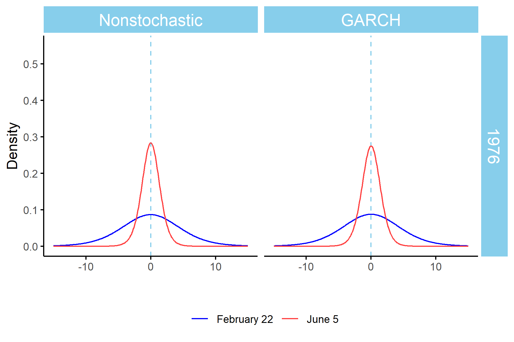

Decline in Variability on Svalbard
================

*Contributors: Sondre Hølleland<sup>†</sup>, Hans Arnfinn Karlsen.
University of Bergen, Norway.*

*<sup>†</sup> Responsible for the code.*

*Correspondance to: <sondre.holleland@uib.no>*

*The full paper can be found here (link will come).*

This repository contains the necessary code for reproducing results from
the paper *Decline in Variability on Svalbard*. To run all the code,
install the necessary packages by the following code:

``` r
list.of.packages <- c("TMB", "ggplot2", "zoo", "lubridate", "reshape2",
                      "forecast", "xtable", "doParallel", "mapsdata",
                      "plyr", "dplyr", "ggpubr", "fGarch")
# The following code will install the missing packages: 
new.packages <- list.of.packages[!(list.of.packages %in% installed.packages()[, "Package"])]
if(length(new.packages)) install.packages(new.packages)
```

To execute the code, you may use the script *R/0\_main.R* to run the
different subscripts. This will generate the figures in the *Figures*
folder and tables in .tex format in the *Tex* folder. In the folder
*Bootstrap\_and\_MC\_results*, you will find three .Rdata files
containing the results from the bootstrap and Monte Carlo used in the
paper. However, if you run your own, these will be replaced. More on
this below. The *Animations* folder will be filled up with .png files
when running the *R/5\_making\_animations.R* script, but to make the gif
files, I use the ffmpeg software for MS Windows.

The likelihood for the parametric volatility is implmented using the
[TMB package](https://github.com/kaskr/adcomp/wiki), which requires a
C++ compilator. Follow the instructions for [download and installing
TMB](https://github.com/kaskr/adcomp/wiki/Download).

**The bootstrap** takes about an hour to run with seven parallel
workers. If not adjusted, the script will use one less than the number
of available cores. By setting BOOT\_RUN = FALSE, the code will use the
prerun results.

**The Monte Carlo** takes about 8 minutes to run with seven parallel
workers. If not adjusted, the script will use one less than the number
of available cores. By setting MC\_RUN = FALSE, the code will use the
prerun results.

## Animations

Animations using the unconditional variances are included as
supplementary material to the paper. These are the distribution of the
regression model residuals for every day of the years 1979 and 2019 and
for every year between 1976 and 2019 on February 20 and June 5. The
parametric form is a t-distribution with respectively 9.18 and 10.34
degrees of freedom for the nonstochastic and GARCH model, respectively.




## Data

The data is downloaded from [eklima.no](http://eklima.no), published
here in accordance with the [Creative Commons 3.0
licence](https://creativecommons.org/licenses/by/3.0/no/) and thus with
permission of [Norwegian Meteorological
Institute](https://www.met.no/en) .

[](https://www.met.no/en)

## Author’s github account

**Sondre Hølleland** - [holleland](https://github.com/holleland)

## License

This project is licensed under the GNU GPLv3 License - see
[LICENSE.md](LICENSE.md) for details. The data is licenced under [CC
BY 3.0](https://creativecommons.org/licenses/by/3.0/no/).
